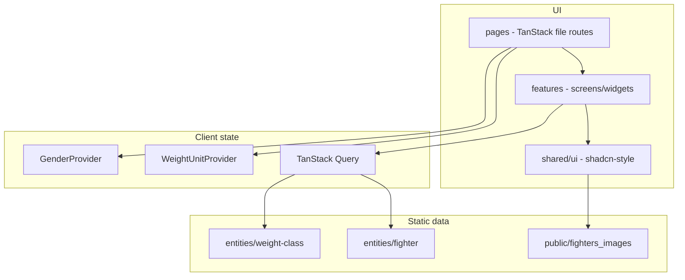

# CageScale architecture

## Overview

CageScale is a **Vite SPA** (no SSR). All UFC data is **static** and loaded through TanStack Query wrappers that simulate async fetch (`delay()`), so the UI is ready for a future API without changing call sites.

## Repository layout

| Layer | Path | Responsibility |
|--------|------|----------------|
| **App shell** | `src/app/` | Global styles, providers, generated `routeTree.gen.ts` |
| **Routes** | `src/pages/` | TanStack Router file routes (`__root`, `index`, `weight-finder`, `fighters.$fighterId`) |
| **Features** | `src/features/*/` | User-facing UI composed for one capability (weight classes list, finder, profile widgets) |
| **Entities** | `src/entities/*/` | Domain types, static seed, pure helpers, thin “API” functions + query keys |
| **Shared** | `src/shared/` | Design-system UI, units/height formatting, query client |

**Dependency rule:** `pages` → `features` → `entities` → `shared`. No imports from `pages` into `entities`.

## Routing

| Route | Page | Notes |
|-------|------|--------|
| `/` | Divisions | Gender-filtered list; accordion sections |
| `/weight-finder` | My Weight | 3-col class + estimates |
| `/fighters/$fighterId` | Fighter profile | Deep link; bottom nav inactive on Divisions (exact `/`) |

Router plugin: `@tanstack/router-plugin` → `src/app/routeTree.gen.ts`.

## Global UI state

| Provider | Location | Used for |
|----------|----------|----------|
| `GenderProvider` | `src/app/providers/gender-provider.tsx` | Men/Women header switch; division filter + weight ladder |
| `WeightUnitProvider` | `src/app/providers/weight-unit-provider.tsx` | kg/lb primary ordering and bold-first dual display |

Both wrap the tree in `AppProviders` (`QueryClientProvider` outermost).

## Data model

### Weight class (`entities/weight-class`)

- `WEIGHT_CLASSES` — limits, gender, order
- `champions.ts` — last N champions per division (`ChampionReignSummary`: fighter id, first belt year, reign metadata; **not** shown as “current champ” in UI)
- `getWeightClasses()` — merges classes + recent champions for Query

### Fighter (`entities/fighter`)

- `data.ts` — profiles (record, timelines, chips data)
- `fighter-heights.ts` — listed heights (cm) keyed by slug id
- `getFighter(id)` — throws if unknown id

Fighter slug ids match URL param and photo filenames (e.g. `joshua-van`).

## Presentation conventions

- **Dual weight:** `DualWeight` / `DualWeightRange` (`shared/ui/dual-weight.tsx`) respect `WeightUnitProvider`.
- **Dual height:** `formatHeightDual` / `FighterHeight` — always `cm / ft'in"`.
- **Photos:** `FighterPhoto` tries `/fighters_images/{id}.{webp|jpg|jpeg|png}` then `fighterAvatar(name)`.

## Build & deploy

- **Build:** `npm run build` → `tsc -b` + Vite → `dist/`
- **Vercel:** `vercel.json` — `framework: vite`, SPA rewrite to `index.html`
- **Node:** `engines.node >= 20` in `package.json`

## Scripts (non-production)

- `scripts/smoke.mjs` — Playwright smoke (dev dependency optional; install playwright locally to run)
- `scripts/demo-video.mjs` — records walkthrough

## Extension points

1. **New fighter:** add row in `data.ts`, height in `fighter-heights.ts`, optional image in `public/fighters_images/`, reference in `champions.ts` if needed.
2. **New division:** extend `WeightClassId`, `data.ts`, `champions.ts` lineage.
3. **Live API:** replace `entities/*/api/*.ts` implementations; keep query keys and return types.

## Testing

No unit test suite yet. Prefer `npm run build` + smoke script after UI changes. Manual walkthrough: Divisions accordion, fighter link, My Weight 3-col layout, header toggles.
